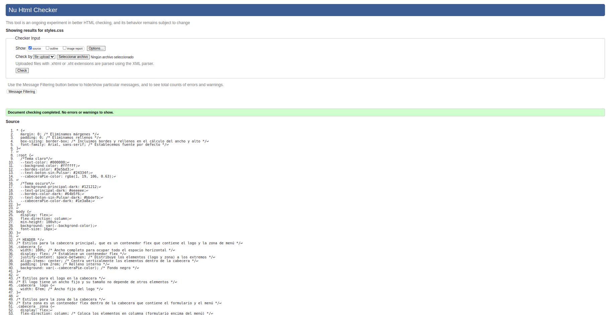
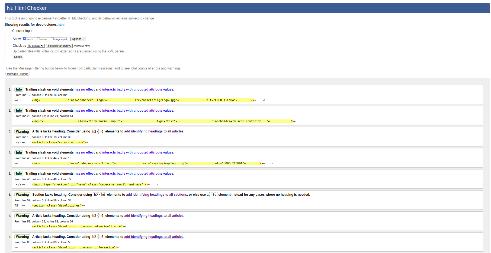
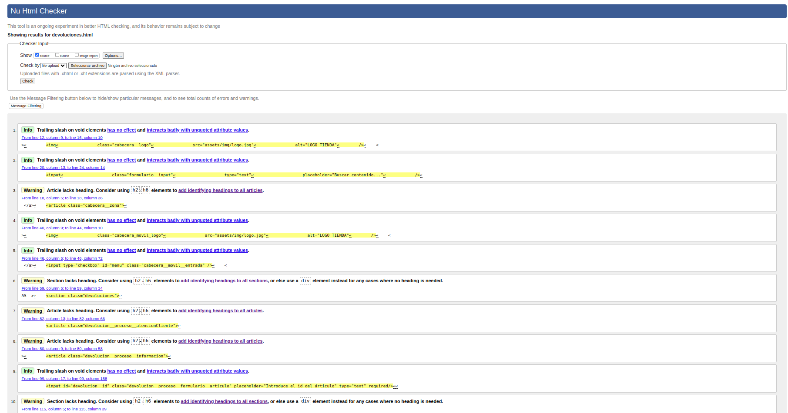
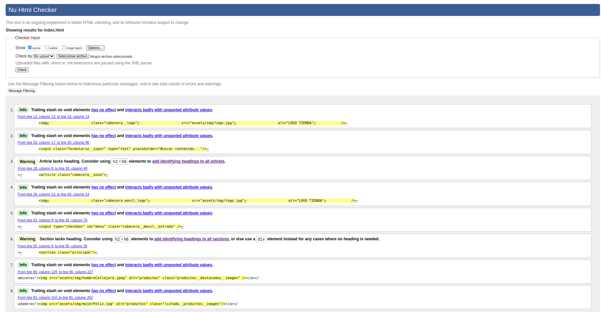
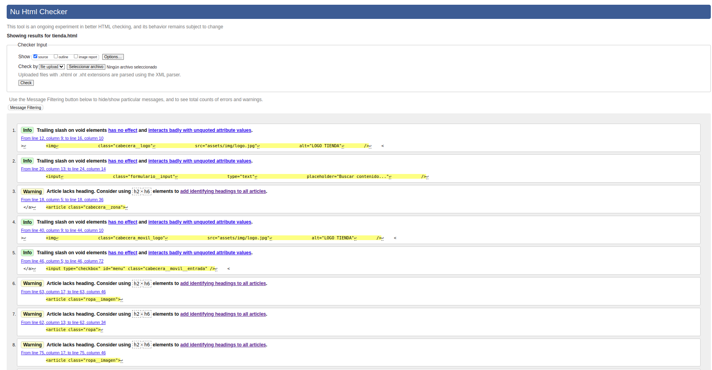

# ProyectoSegundoTrimetre

## Sobre mi proyecto

He creado una página web enfocandome en la parte de tienda online de ropa o calzado.
En dicha página he hecho una página de inicio que lo que yo quería era dar una información general al usuario
y unos enlaces para ahorrarse tiempo navegando por el menú.

En la página de tienda la dividí por secciones dependiendo de que tipo de ropa fuese por ejemplo
camiseta, calzado y sudadera. En estas secciones incluí imagenes ,el nombre del producto y su precio.
En las imágenes puse una imágen que mostraba su parte frontal y cuando pongas el ratón encima mostrará otra perspectiva logrando
que el cliente pueda verificar si es el producto que desea por todas las caras.

También puse una página de devoluciones ya que lo veo una gran necisdad sobre todo para las personas que compren online y se encuentren
lejos de la tienda física. En dicha página puse unas instrucciones y reglas a cumplir para realizar la devolución y un formulario
para envíar la devolución. Luego puse una tabla con las medidas en caso de que el usuario se haya equivocado en la talla, de esta forma
el usuario podrá tomarse las medidas y nunca volver a tener que devolver un producto por talla incorrecta.

Al ser una tienda online necesitaba un formulario de contacto ya que los cupones, rebajas y ofertas de temporada.
Les podría interesar a los apasionados de la ropa por lo que necesitaba conocer el correo o número de dichos clientes por lo que 
puse un formulario para guardar esos datos. También di información acerca de la tienda física y los horarios ya que lo veía importante
por si quieres conocernos en persona o te gustaría ir físicamente a comprar. Abajo puse unos patrocinadores por que fueron los que ayudaron
a que la empresa pudiera iniciar en este mundo, gracías a ellos hemos podido mejorar nuestro servicios
y productos logrando lo que somos hoy en día. 

He organizado la estructura de mi proyecto en 3 / 4 secciones, estas secciones dependerán de cada página
pero he intentado organizar el contenido que tiene el mismo contexto en cada sección y dentro he usado article o sectión para agruparlo mejor
y que quede más claro a aquellos que quierán leer el código de la página web.

En cuanto a la estructura de carpetas he usado js > ficheros.js, css > ficheros.css, assets > img > imágenes. 
De esta forma todo el contenido estaría organizado correctamente.
## Validación
Para realizar la validación de errores de mi página web he usado w3c validator.
Para la estructura semántica he seguido los pasos de la métodología BEM y sin errores ya que lo verificaba con w3c validator.
Para dicha validación lo que hice fue ir añadiendo fichero a fichero en w3c validator para comprobar si me daba errores 
y los corregí. 

La mayoría de los warning son todos compartidos por la cabecera y pie de página pero son no poner un titulo a algún article por lo que no son importantes.
En la validación del css no me mostró ningun warning ni error.

En la página de contacto solo me mostró información y no tenía ningún error.

En la página de devolución solo me mostró información y no tenía ningún error.

En la página de index solo me mostró información y no tenía ningún error.

En la página de tienda solo me mostró información y no tenía ningún error.

## Como validar
Para comprobar la validación de lá página web deberá ir a la siguiente página web:
https://validator.w3.org/
En esta página web tendrá que introducir el enlace de cada página que contiene mi página web por ejemplo la de contacto.html

Luego verás la información al respecto que te da el validator pero no te va a mostrar ningún error, Porque no tiene errores.

## Funcionalidades principales de las etiquetas html
- html: Define el contenido del documento html
- head: Contiene los metadatos o enlaces a hojas de estilos.
- title: Define el titulo que aparecerá en la ventana del navegador.
- body: Define la estructura del cuerpo del documento.
- h1-6: Define los encabezados, cada uno tendrá una medida distinta.
- p: Parrafo de texto
- a: enlaces.
- img: Imagenes.
- ul / ol / li: Definen la estructura de una lista siendo ul lista ordenada y ol no ordenada y li los elementos de dichas listas.

Alguna de estas etiquetas no requieren de un cierre por ejemplo la etiqueta img.
Se recomienda que se utilize siempre los encabezados en función del nivel y modificar el tamaño o estilo desde el css.
Las etiquetas pueden tener clases, id: Las clases y el id sirven para poder identificar a dicha etiqueta
de forma única para poder modificarla en el css o usar ese id como enlace.

## e) Se han utilizado herramientas en la creación de documentos web.
He utilizado webStorm para editar el código junto con prettier y algúnas extensiones
para la visualización del código en tiempo real. También he usado git y github para el control de versiones.

## f) Se han identificado y demostrado de forma práctica las ventajas que aporta la utilización de hojas de estilo. g) Se han aplicado hojas de estilo.

Esta actividad era de forma práctica por lo que no se necesita realizar ninguna aclaración

## Ejemplos de uso de animaciones
Con esta animación me definí el carrusel de la página principal.
https://github.com/Alejandro-Bravo2/ProyectoSegundoTrimetre/blob/d72a73cc5f25d9147ed452c51e043184f42168d0/css/styles.css#L241-L267

La animación utilizada lo que va haciendo es añadir margen a la derecha para ir cambiando de imagen
y como el article tiene una propiedad de overflow lo que me permite es que
en caso de que la imágen sea mayor al tamaño asignado lo que hará es recortarla
por lo que estaría recortando las 3 imágenes.
https://github.com/Alejandro-Bravo2/ProyectoSegundoTrimetre/blob/d72a73cc5f25d9147ed452c51e043184f42168d0/css/styles.css#L445-L473

Con esta animación pude realizar que en la página de tienda cuando se pusiera el ratón 
encima de la imágen se mostrase la imágen desde otra perspectiva:
https://github.com/Alejandro-Bravo2/ProyectoSegundoTrimetre/blob/d72a73cc5f25d9147ed452c51e043184f42168d0/css/styles.css#L270-L324

Otros ejemplos en los que haya usado animaciones
para cambiar el estado de dicha etiqueta:
https://github.com/Alejandro-Bravo2/ProyectoSegundoTrimetre/blob/d72a73cc5f25d9147ed452c51e043184f42168d0/css/styles.css#L69-L71

https://github.com/Alejandro-Bravo2/ProyectoSegundoTrimetre/blob/d72a73cc5f25d9147ed452c51e043184f42168d0/css/styles.css#L85-L88

https://github.com/Alejandro-Bravo2/ProyectoSegundoTrimetre/blob/d72a73cc5f25d9147ed452c51e043184f42168d0/css/styles.css#L108-L114

https://github.com/Alejandro-Bravo2/ProyectoSegundoTrimetre/blob/d72a73cc5f25d9147ed452c51e043184f42168d0/css/styles.css#L199-L203

https://github.com/Alejandro-Bravo2/ProyectoSegundoTrimetre/blob/d72a73cc5f25d9147ed452c51e043184f42168d0/css/styles.css#L224-L227

También hay más ejemplos pero la mayoría son parecidos.

## Uso de responsive
Con este responsive cambie las imágenes de genero de la página principal
para que no se juntaran ambas imágenes y para eso los puse en columna.
https://github.com/Alejandro-Bravo2/ProyectoSegundoTrimetre/blob/d72a73cc5f25d9147ed452c51e043184f42168d0/css/styles.css#L626-L640

Aqui lo que hacemos es ocultar el header y activamos el header definido para móbiles
también modifico el tamaño de algunos textos para que se ajusten a la ventana.
https://github.com/Alejandro-Bravo2/ProyectoSegundoTrimetre/blob/d72a73cc5f25d9147ed452c51e043184f42168d0/css/styles.css#L643-L750